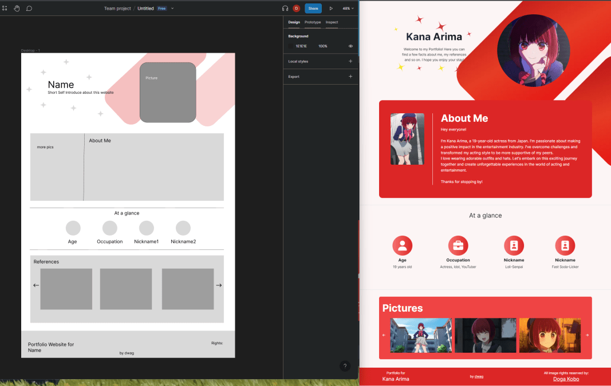
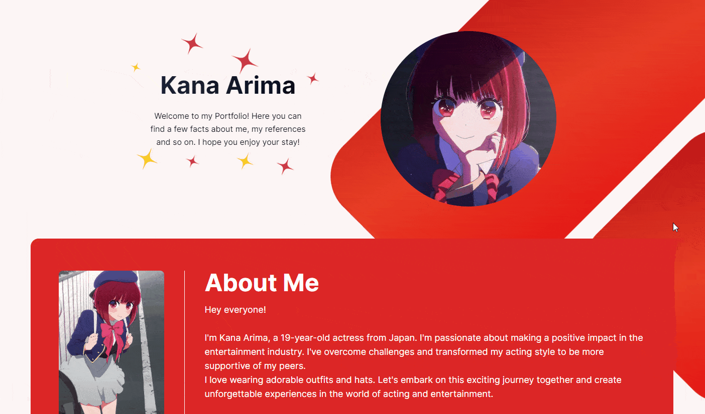

## What is the goal of this project?
Today, I came up with the idea of creating portfolios for various anime characters from different anime series, focusing on new shows and selecting at least one character from each season. The main goal of this project is to enhance my design skills and gain a better understanding of the design process. Additionally, I couldn't find anyone who had done this before, so I thought it would be a good idea to initiate this project.

### The First Portfolio: Kana Arima from "Oshi no Ko" (2023 - Spring)
[GitHub Repository](https://github.com/DanielWTE/kana-arima/)
[Website](https://kana-arima.com/)
#### Why Kana Arima?
I have always wanted to create a website with a red theme, so I decided to start with Kana Arima since she has red hair. Moreover, I really admire her character design and personality.

For the concept, I used Figma and drew inspiration from my previous projects. Here's a preview of the Kana Arima portfolio concept:

To build the website, I utilized NextJS, TailWindCSS, and various other tools. Here's a glimpse of the Kana Arima portfolio website in action:
