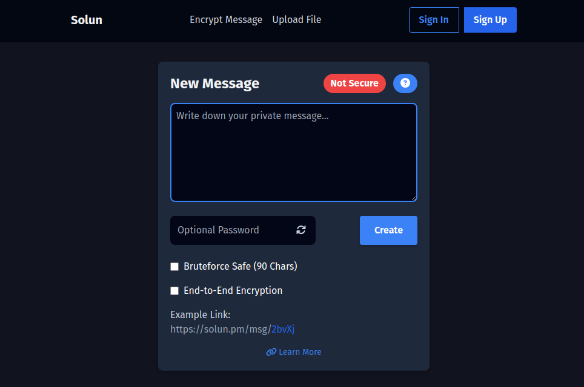
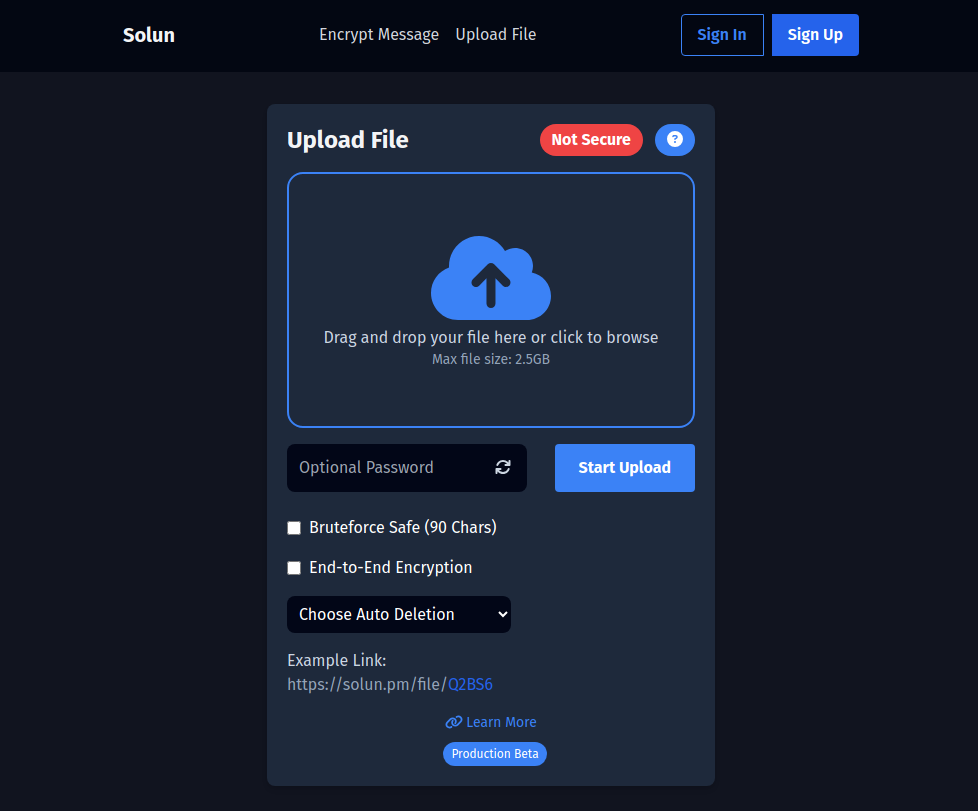

## What is Solun?
Solun is a service that enables you to securely share files, texts, and send emails with end-to-end encryption, providing peace of mind for your privacy. Additionally, it offers the ability to create a free email account and the option to add custom domains.

## What is the purpose of Solun?
Solun's mission is to bridge the privacy gap by providing an independent and open service for secure file sharing, text communication, and email transmission with end-to-end encryption. Our goal is to offer a comprehensive solution that eliminates the need for external platforms such as WhatsApp, Telegram, Signal, and others.

Furthermore, we aim to simplify the process of using your own domain with our email accounts, removing any concerns related to the technical aspects involved.

## Which technologies are used?
- **Next.js**: Next.js is a technology used in this project for server-side rendering and building React applications.

- **Express**: Express is a web application framework for Node.js that provides a set of features for building web servers and APIs.

- **MongoDB**: MongoDB is a NoSQL database used in this project to store and manage data.

- **Docker**: Docker is a platform used for containerization, allowing applications to be packaged and run in isolated environments.

- **Git**: Git is a version control system used for tracking changes in code and collaborating with other developers.

- **TypeScript**: TypeScript is a superset of JavaScript that adds static typing, providing improved developer productivity and code quality.

## What will I talk about in this article regarding Solun?

In this article, I will delve into the coding aspects of Solun and provide insights into the individual repositories involved. For those interested in exploring the technical server-side details further, I recommend referring to the dedicated section on my friend and colleague Jannik's website, [Solun - Technical Server-Side Details](https://jsde.me/posts/solun/).

## How is Solun structured?
Solun is structured using a combination of eight repositories that are essential for the overall application functionality.

- **Solun** -> [Repository (Web Frontend)](https://github.com/solun-pm/solun)
- **Solun Auth** -> [Repository (Web Frontend)](https://github.com/solun-pm/solun-auth)
- **Solun Webmail** -> [Repository (Web Frontend)](https://github.com/solun-pm/solun-webmail)
- **Solun API** -> [Repository (Backend)](https://github.com/solun-pm/solun-api)
- **Solun-Delete-Bird** -> [Repository (Script)](https://github.com/solun-pm/solun-delete-bird)
- **Solun-General-Package** -> [Repository (Package)](https://github.com/solun-pm/solun-general-package)
- **Solun-Database-Package** -> [Repository (Package)](https://github.com/solun-pm/solun-database-package)
- **Solun-Server-Encryption-Package** -> [Repository (Package)](https://github.com/solun-pm/solun-server-encryption-package)

These applications, scripts, and packages collectively form the foundation of Solun, enabling its smooth and functional operation for secure file sharing, text communication, and email services.

## Solun
The Solun repository contains the frontend code for the Solun website, which is built using Next.js and TypeScript. You can access the website at [https://solun.pm](https://solun.pm).

On the Solun website, users can explore detailed information about the platform and its features. Additionally, users have the opportunity to sign up for a free account and utilize the services provided.

One of the notable features available is the "One-Time Secret" functionality, which allows users to send confidential messages that will be automatically deleted after the first view. This feature is particularly useful for securely sharing sensitive information such as passwords, credit card details, and other private data.

Another notable feature is the "File Sharing" capability, enabling users to upload files and share them with others. These shared files are automatically deleted after a user-defined timeframe, ensuring privacy and control over shared content.

All features on the Solun website are accessible without the need to sign up for an account. However, users who wish to use a free email account or add a custom domain must create an account.